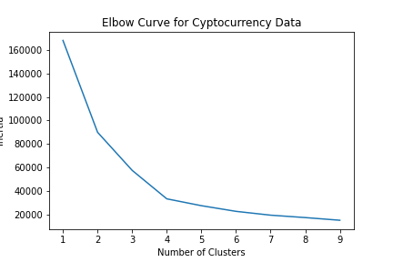

# Cryptocurrency Clusters

## Background

* As part of the Advisory Services Team of a financial consultancy, a report has been created that includes what cryptocurrencies are on the trading market and determine whether they can be grouped to create a classification system for this new investment.

* I used raw data and implemented unsupervised learning. Used several clustering algorithms to explore whether the cryptocurrencies can be grouped together with other similar cryptocurrencies. 

## Steps

### Data Preparation

* Read `crypto_data.csv` into Pandas. The dataset was obtained from [CryptoCompare](https://min-api.cryptocompare.com/data/all/coinlist).

* Discard all cryptocurrencies that are not being traded. In other words, filter for currencies that are currently being traded. Then, drop the `IsTrading` column from the dataframe.

* Remove all rows that have at least one null value.

* Filter for cryptocurrencies that have been mined. That is, the total coins mined should be greater than zero.

* Convert data to numeric. Since the coin names do not contribute to the analysis of the data, delete the `CoinName` from the original dataframe.

* Convert the remaining features with text values, `Algorithm` and `ProofType`, into numerical data. To accomplish this task, use Pandas to create dummy variables. Examine the number of rows and columns of the dataset. 

* Standardize the dataset so that columns that contain larger values do not unduly influence the outcome.

### Dimensionality Reduction

* Creating dummy variables above dramatically increased the number of features in the dataset. Perform dimensionality reduction with PCA. Using `PCA(n_components=0.99)` creates a model that will preserve approximately 99% of the explained variance, whether that means reducing the dataset to 80 principal components or 3. For this project, preserve 90% of the explained variance in dimensionality reduction. 

* Next, further reduce the dataset dimensions with t-SNE and visually inspect the results. In order to accomplish this task, run t-SNE on the principal components: the output of the PCA transformation. Then create a scatter plot of the t-SNE output:

### Cluster Analysis with k-Means

* Create an elbow plot to identify the best number of clusters. Use a for-loop to determine the inertia for each `k` between 1 through 10. Determine, if possible, where the elbow of the plot is, and at which value of `k` it appears.

### Recommendation

* Following review of the Elbow plot above, the cryptocurrencies can be grouped into 4 clusters. 

## Rubric

[Unit 20 - Unsupervised Machine Learning Homework Rubric - Cryptocurrency Clusters](https://docs.google.com/document/d/1zhiC8-PtfMknDxYHagsTukryQAJSdXFRWa-aK3W28Vg/edit?usp=sharing)

- - -

## References

Crypto Coin Comparison Ltd. (2020) Coin market capitalization lists of crypto currencies and prices. Retrieved from [https://www.cryptocompare.com/coins/list/all/USD/1](https://www.cryptocompare.com/coins/list/all/USD/1)

- - -

© 2021 Trilogy Education Services, LLC, a 2U, Inc. brand. Confidential and Proprietary. All Rights Reserved.
